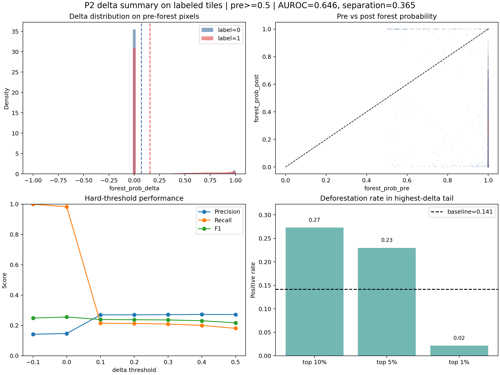
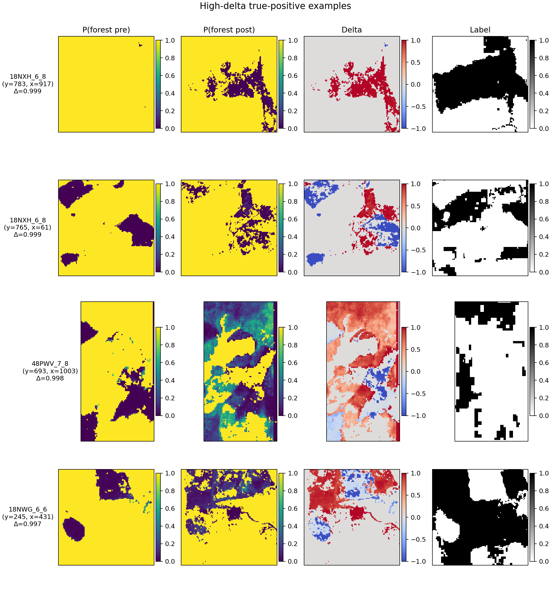
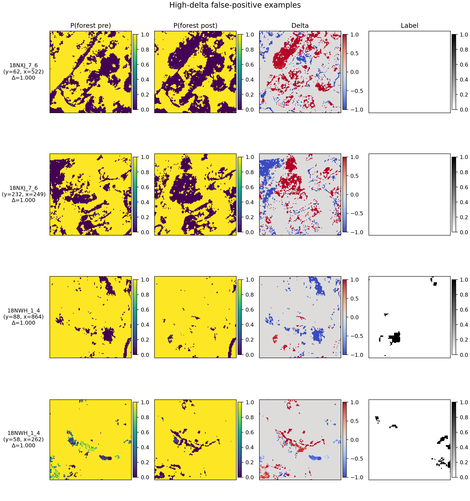

# P2 Probability Statistics

Focus: cached `forest_prob_pre`, `forest_prob_post`, and especially `forest_prob_delta` on the 10 labeled training tiles.

## Headline numbers

- Labeled tiles analyzed: **10**
- Total labeled pixels: **10,145,868**
- Pre-forest analysis set (`prob_pre >= 0.5`): **7,829,132** pixels (77.2% of labeled pixels)
- Deforestation prevalence within pre-forest set: **0.141**
- Mean delta on pre-forest pixels: **+0.1553** for `label=1` vs **+0.0701** for `label=0`
- Separation `|Δμ| / σ_neg`: **0.365**
- AUROC for raw delta as a scorer: **0.646**
- Pearson corr(delta, label) on pre-forest pixels: **0.120**
- Near-zero delta share (`|delta| <= 0.02`): **88.2%** overall, **78.5%** on `label=1`, **89.8%** on `label=0`
- Extreme positive tail (`delta >= 0.95`): **2.7%** overall, **3.1%** on `label=1`, **2.7%** on `label=0`

## Distribution notes

- Overall delta distribution is right-shifted on pre-forest pixels: median **+0.000**, 90th percentile **+0.445**, 99th percentile **+0.995**.
- Deforested pixels have a heavier positive tail: 90th percentile **+0.769** vs **+0.000** for stable pixels.
- The negative-class median is still positive (**+0.000**), which matches the earlier observation that post-period drift is noisy even without true deforestation.
- The distribution piles up very close to `0`, while a smaller but important tail jumps close to `1`. That is why the top 1% behaves worse than the top 5-10%: the very highest scores are often saturated false alarms.

## Threshold view

| delta threshold | precision | recall | f1 | predicted share |
|---|---:|---:|---:|---:|
| `-0.1` | 0.142 | 1.000 | 0.249 | 0.995 |
| `+0.0` | 0.147 | 0.982 | 0.256 | 0.945 |
| `+0.1` | 0.270 | 0.215 | 0.239 | 0.113 |
| `+0.2` | 0.270 | 0.213 | 0.238 | 0.111 |
| `+0.3` | 0.271 | 0.209 | 0.236 | 0.109 |
| `+0.4` | 0.273 | 0.200 | 0.231 | 0.104 |
| `+0.5` | 0.272 | 0.181 | 0.217 | 0.094 |

## High-delta tail

| slice | cutoff | pixels | positive rate | lift vs baseline |
|---|---:|---:|---:|---:|
| top 10% | +0.445 | 782,916 | 0.273 | 1.93x |
| top 5% | +0.822 | 391,458 | 0.230 | 1.63x |
| top 1% | +0.995 | 78,293 | 0.022 | 0.15x |

## Quantiles

| quantile | all pre-forest | label=1 | label=0 |
|---|---:|---:|---:|
| 0.01 | -0.000 | -0.000 | -0.000 |
| 0.05 | -0.000 | +0.000 | -0.000 |
| 0.10 | +0.000 | +0.000 | +0.000 |
| 0.25 | +0.000 | +0.000 | +0.000 |
| 0.50 | +0.000 | +0.000 | +0.000 |
| 0.75 | +0.000 | +0.000 | +0.000 |
| 0.90 | +0.445 | +0.769 | +0.000 |
| 0.95 | +0.822 | +0.906 | +0.780 |
| 0.99 | +0.995 | +0.985 | +0.996 |

## Figures

## Example callouts

- Strongest true-positive example in this pass: tile `18NXH_6_8` at `(y=783, x=917)`, delta **0.999**.
- Strongest false-positive example in this pass: tile `18NXJ_7_6` at `(y=62, x=522)`, delta **1.000**.
- The verification panels are meant to answer a simple question: when delta spikes, do we see a localized drop from `prob_pre` to `prob_post`, and does that overlap the GT deforestation mask or not?
